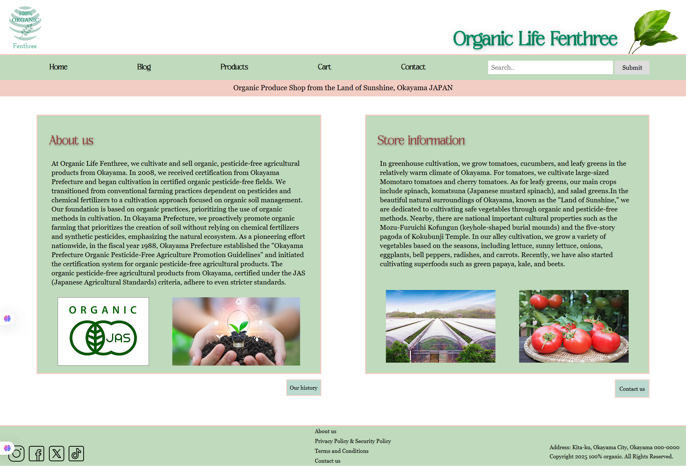
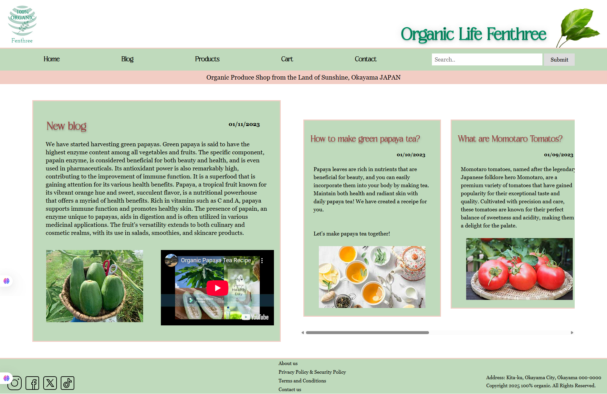
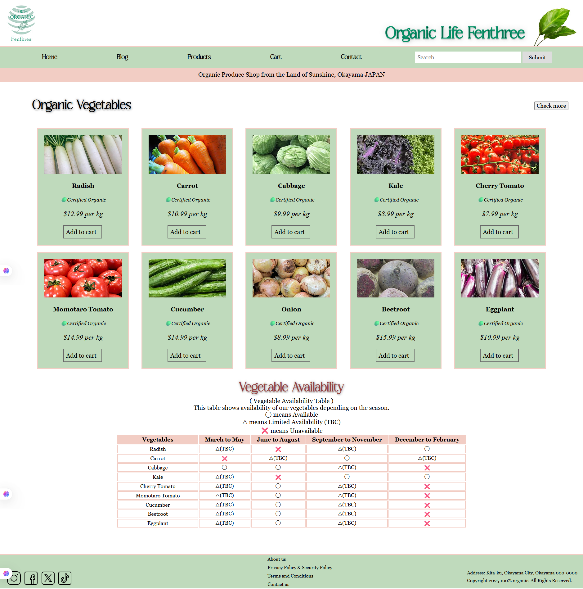
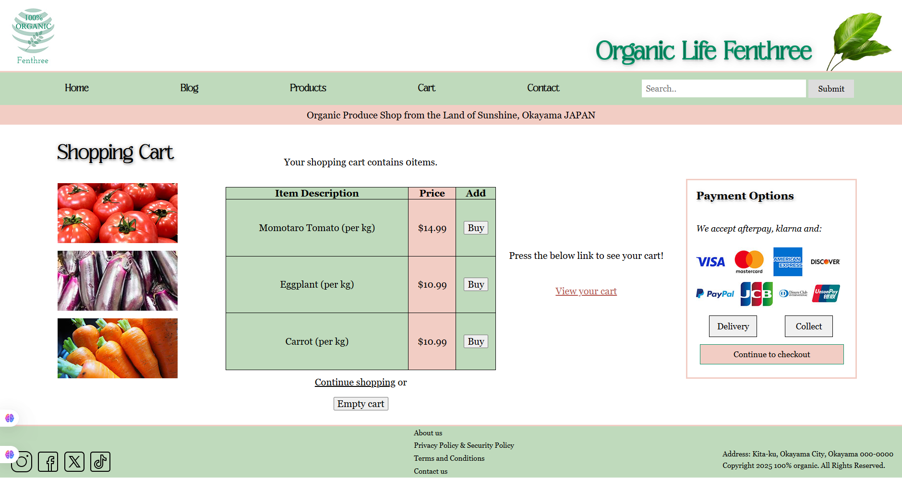
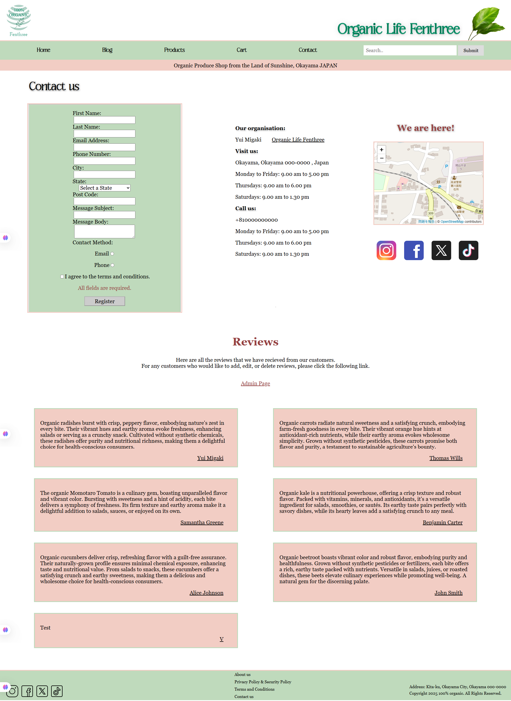

I built my first personal project website during Certificate IV at TAFE.
I developed it using PHP, HTML, CSS, SCSS, and JavaScript.
I also created an admin portal connected to a MySQL database to manage customer reviews and display them on the contact page.

